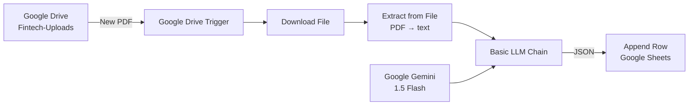

# Vitto Fintech Operations Automation

An end-to-end **n8n** workflow that automates document intake for Vitto's operations team. When a new PDF lands in a monitored Google Drive folder, the pipeline extracts its text, sends it to **Google Gemini 1.5 Flash** for structured analysis, and appends the results to a **Google Sheet** for tracking.

---

## Table of Contents

- [Overview](#overview)
- [Features](#features)
- [Architecture](#architecture)
- [Tech Stack](#tech-stack)
- [Project Structure](#project-structure)
- [Prerequisites](#prerequisites)
- [Setup Guide](#setup-guide)
  - [1. Run n8n](#1-run-n8n)
  - [2. Import the Workflow](#2-import-the-workflow)
  - [3. Configure Google Cloud & OAuth](#3-configure-google-cloud--oauth)
  - [4. Set Up Google Gemini API](#4-set-up-google-gemini-api)
  - [5. Prepare Google Drive & Sheets](#5-prepare-google-drive--sheets)
  - [6. Wire Up Credentials in n8n](#6-wire-up-credentials-in-n8n)
  - [7. Activate & Test](#7-activate--test)
- [Workflow Nodes (Step-by-Step)](#workflow-nodes-step-by-step)
- [AI Prompt Design](#ai-prompt-design)
- [Google Sheet Schema](#google-sheet-schema)
- [Configuration Reference](#configuration-reference)
- [Testing Checklist](#testing-checklist)
- [Limitations & Edge Cases](#limitations--edge-cases)
- [Roadmap](#roadmap)
- [Troubleshooting](#troubleshooting)

---

## Overview

Operations teams often receive invoices, contracts, and reports as PDFs scattered across email and shared drives. Manually reading each file, extracting key details, and logging them in a tracker is slow and error-prone.

This project replaces that manual loop with a fully automated pipeline:

1. **Detect** new files in a dedicated Google Drive upload folder.
2. **Extract** plain text from each PDF.
3. **Analyze** the text with Gemini to produce structured operational insights.
4. **Archive** the output as a new row in Google Sheets.

The result is a live, searchable log of document metadata and action items — without anyone opening the PDF by hand.

---

## Features

| Feature | Description |
|---------|-------------|
| **Automatic file detection** | Polls Google Drive every minute for newly created files in a specific folder |
| **PDF text extraction** | Built-in n8n PDF parser — no external OCR service required for native-text PDFs |
| **AI-powered summarization** | Gemini returns strict JSON with document type, entity, impact, deadlines, and next steps |
| **Structured logging** | Parsed fields map directly to Google Sheets columns — no manual copy/paste |
| **Visual debugging** | n8n's node-by-node execution view makes it easy to inspect data at each step |

---

## Architecture



**Data flow:**

```
PDF uploaded to Drive
  → Trigger fires (fileCreated event)
  → File downloaded as binary
  → Text extracted from PDF
  → Gemini analyzes text → returns JSON
  → JSON fields mapped to sheet columns
  → New row appended to tracker sheet
```

---

## Tech Stack

| Layer | Technology | Why |
|-------|------------|-----|
| Workflow engine | [n8n](https://n8n.io/) | Visual pipeline builder with native Google & AI integrations |
| AI model | Google Gemini 1.5 Flash | Fast inference, large context window, generous free tier |
| File storage | Google Drive | Familiar upload surface for the ops team |
| Data store | Google Sheets | Zero-setup tabular view; no database required |

---

## Project Structure

```
n8n-auto/
├── My workflow.json   # Exportable n8n workflow (import this file)
├── prompt.md          # AI system/user prompt documentation & design rationale
├── writeup.md         # High-level system write-up and production roadmap
└── README.md          # This file
```

---

## Prerequisites

Before importing the workflow, make sure you have:

- An **n8n instance** (self-hosted or [n8n Cloud](https://n8n.io/cloud/))
- A **Google account** with access to Google Drive and Google Sheets
- A **Google Cloud project** with the Drive API and Sheets API enabled
- A **Google Gemini API key** from [Google AI Studio](https://aistudio.google.com/)

---

## Setup Guide

### 1. Run n8n

If you don't already have n8n running locally:

```bash
npx n8n
```

Then open [http://localhost:5678](http://localhost:5678) in your browser.

For production, follow the [official n8n self-hosting docs](https://docs.n8n.io/hosting/).

---

### 2. Import the Workflow

1. Open your n8n instance.
2. Go to **Workflows** → **Import from File**.
3. Select `My workflow.json` from this repository.
4. The workflow appears as **"My workflow"** with six connected nodes.

> **Note:** Credential IDs in the exported JSON belong to the original author's n8n instance. You will re-create all credentials in your own environment (see step 6).

---

### 3. Configure Google Cloud & OAuth

1. Go to the [Google Cloud Console](https://console.cloud.google.com/).
2. Create a project (or select an existing one).
3. Enable these APIs:
   - **Google Drive API**
   - **Google Sheets API**
4. Configure the **OAuth consent screen** (External or Internal, depending on your org).
5. Create **OAuth 2.0 Client ID** credentials (type: **Web application**).
6. Add your n8n OAuth redirect URI. For local n8n, this is typically:
   ```
   http://localhost:5678/rest/oauth2-credential/callback
   ```
7. Save the **Client ID** and **Client Secret** — you'll need them in n8n.

---

### 4. Set Up Google Gemini API

1. Visit [Google AI Studio](https://aistudio.google.com/).
2. Click **Get API key** and create a key for your project.
3. In n8n, you'll add this key as a **Google Gemini (PaLM) API** credential on the **Google Gemini Chat Model** node.

---

### 5. Prepare Google Drive & Sheets

#### Google Drive folder

1. Create a folder in Google Drive (e.g. `Fintech-Uploads`).
2. Copy the **Folder ID** from the URL:
   ```
   https://drive.google.com/drive/folders/<FOLDER_ID>
   ```
3. In the **Google Drive Trigger** node, set **Folder to Watch** to your folder.

#### Google Sheet

1. Create a new Google Sheet (e.g. `vitto-automation`).
2. Add these headers in **row 1** of Sheet1:

   | A | B | C | D | E |
   |---|---|---|---|---|
   | Company | Type | Operational Impact | Deadlines & Terms | Next Steps |

3. Copy the **Spreadsheet ID** from the URL:
   ```
   https://docs.google.com/spreadsheets/d/<SPREADSHEET_ID>/edit
   ```
4. In the **Append row in sheet** node, set **Document** to your spreadsheet and **Sheet** to `Sheet1`.

---

### 6. Wire Up Credentials in n8n

Open each node and attach credentials:

| Node | Credential type | Notes |
|------|----------------|-------|
| Google Drive Trigger | Google Drive OAuth2 API | Sign in with the Google account that owns the upload folder |
| Download file | Google Drive OAuth2 API | Same account as above |
| Google Gemini Chat Model | Google Gemini (PaLM) API | Paste your AI Studio API key |
| Append row in sheet | Google Sheets OAuth2 API | Sign in with the account that owns the tracker sheet |

Use the same Google OAuth client ID/secret for both Drive and Sheets credentials.

---

### 7. Activate & Test

1. **Save** the workflow.
2. Toggle **Active** to ON (top-right) so the Drive trigger polls automatically.
3. Upload a test PDF with selectable text to your `Fintech-Uploads` folder.
4. Wait up to one minute (poll interval), or click **Execute Workflow** for an immediate manual run.
5. Open your Google Sheet — a new row should appear with the extracted fields.

---

## Workflow Nodes (Step-by-Step)

| # | Node | Type | What it does |
|---|------|------|--------------|
| 1 | **Google Drive Trigger** | Trigger | Polls every minute; fires on `fileCreated` in the configured folder |
| 2 | **Download file** | Google Drive | Downloads the new file by ID; stores binary as `data` |
| 3 | **Extract from File** | File parser | Runs PDF extraction; outputs plain text in `$json.text` |
| 4 | **Basic LLM Chain** | LangChain | Sends extracted text + system prompt to Gemini; expects raw JSON back |
| 5 | **Google Gemini Chat Model** | AI sub-node | Provides the Gemini 1.5 Flash model to the LLM Chain |
| 6 | **Append row in sheet** | Google Sheets | Parses LLM JSON and maps fields to sheet columns |

**Connections:**

```
Google Drive Trigger → Download file → Extract from File → Basic LLM Chain → Append row in sheet
Google Gemini Chat Model ──(ai_languageModel)──► Basic LLM Chain
```

---

## AI Prompt Design

The LLM is instructed to act as a Vitto operations assistant and return **only** a raw JSON object — no markdown fences, no conversational filler. This ensures n8n can parse the response with `JSON.parse()` without fragile string manipulation.

### Expected JSON schema

```json
{
  "document_type": "Invoice | Contract | Report | Unknown",
  "key_entity": "Main company or individual name",
  "bullet_1": "Financial or operational impact",
  "bullet_2": "Major deadlines, amounts, or requirements",
  "bullet_3": "Immediate next steps for the ops team"
}
```

### Design rationale

- **Role prompting** sets professional context ("expert operations assistant at Vitto").
- **Strict schema enforcement** guarantees downstream nodes can map fields to sheet columns reliably.
- **Raw JSON output** avoids regex/splitting failures caused by markdown code blocks.

Full prompt documentation lives in [`prompt.md`](./prompt.md).

---

## Google Sheet Schema

| Column | Source field | Example |
|--------|-------------|---------|
| Company | `key_entity` | Acme Corp |
| Type | `document_type` | Invoice |
| Operational Impact | `bullet_1` | Net-30 payment of $12,400 due upon delivery |
| Deadlines & Terms | `bullet_2` | Payment due March 15, 2026 |
| Next Steps | `bullet_3` | Verify PO number and route to AP for approval |

The **Append row in sheet** node uses expressions like:

```
={{ JSON.parse($json.text).key_entity }}
```

to pull each value from the LLM response.

---

## Configuration Reference

These IDs in `My workflow.json` are placeholders from the original setup — **replace them with your own**:

| Setting | Node | Default value (replace) |
|---------|------|------------------------|
| Watch folder | Google Drive Trigger | `Fintech-Uploads` folder ID |
| Spreadsheet | Append row in sheet | `vitto-automation` sheet ID |
| Sheet tab | Append row in sheet | `Sheet1` (gid=0) |
| Poll interval | Google Drive Trigger | Every 1 minute |
| Binary property | Download file | `data` |

---

## Testing Checklist

- [ ] Workflow imported and saved in n8n
- [ ] All four credentials connected and authorized
- [ ] Drive folder ID updated to your folder
- [ ] Spreadsheet ID updated to your sheet
- [ ] Sheet headers match the expected column names exactly
- [ ] Test PDF uploaded to the watch folder
- [ ] Execution completes without errors in n8n
- [ ] New row appears in Google Sheets with all five columns populated
- [ ] Workflow toggled **Active** for automatic polling

---

## Limitations & Edge Cases

| Limitation | Detail |
|------------|--------|
| **PDF type** | Works best with native-text PDFs. Scanned images or heavily blurred documents will fail extraction unless an OCR layer is added upstream. |
| **File type** | The Extract node is configured for PDF only. Other formats (`.docx`, `.txt`) require node changes. |
| **JSON parsing** | If Gemini returns invalid JSON or wraps output in markdown, the Sheets node will error. The strict prompt mitigates this but does not eliminate it entirely. |
| **Google ecosystem** | Currently scoped to Drive + Sheets. No Slack, email, or Discord notifications yet. |
| **No deduplication** | Re-uploading the same file triggers a new row each time. |
| **Poll latency** | With a 1-minute poll interval, there is up to ~60 seconds of delay before processing begins. |

See [`writeup.md`](./writeup.md) for the full production assessment.

---

## Roadmap

Planned improvements for a production deployment:

1. **Multi-channel notifications** — Push summaries to Slack or Discord when high-priority documents arrive.
2. **Error logging tab** — Route extraction and parsing failures to a dedicated "Errors" sheet via IF/THEN branching.
3. **OCR pre-processing** — Add a Google Cloud Vision or Tesseract step for scanned PDFs.
4. **Deduplication** — Track processed file IDs to prevent duplicate rows.
5. **Document-type routing** — Branch workflows by `document_type` (e.g. invoices → AP team, contracts → legal).

---

## Troubleshooting

### Workflow doesn't trigger on new uploads

- Confirm the workflow is **Active** (toggle in top-right).
- Verify the **Folder ID** in the trigger node matches your upload folder.
- Check that the Google account used for Drive OAuth has access to that folder.
- Remember the trigger polls every minute — wait or run manually.

### "Could not extract text" or empty `$json.text`

- The PDF may be image-based (scanned). Try a PDF with selectable/copyable text.
- Open the **Extract from File** node output in n8n to inspect the raw result.

### Google Sheets node fails with a JSON parse error

- Open the **Basic LLM Chain** output and check whether Gemini returned valid JSON.
- If the response includes ` ```json ` fences, tighten the system prompt or add a Code node to strip markdown before parsing.

### OAuth / credential errors

- Re-authenticate the Google credential in n8n (Credentials → your credential → Reconnect).
- Confirm Drive API and Sheets API are enabled in Google Cloud Console.
- Verify the OAuth redirect URI matches your n8n instance URL.

### Gemini API errors (429 / quota)

- Check your usage at [Google AI Studio](https://aistudio.google.com/).
- Gemini 1.5 Flash has rate limits on the free tier — add retry logic or upgrade if needed.

---

## License

This project was built as part of the Vitto Operations Intern Assessment. Use and adapt freely within your organization.
